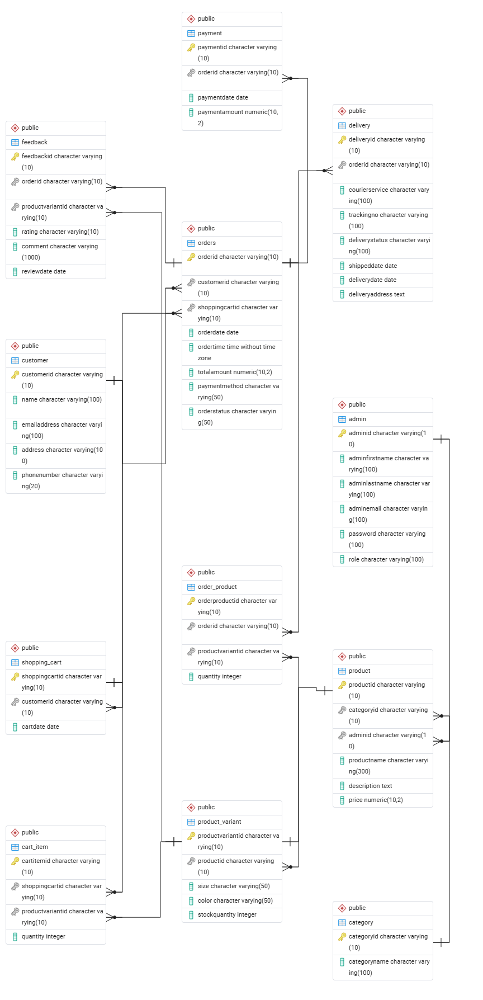
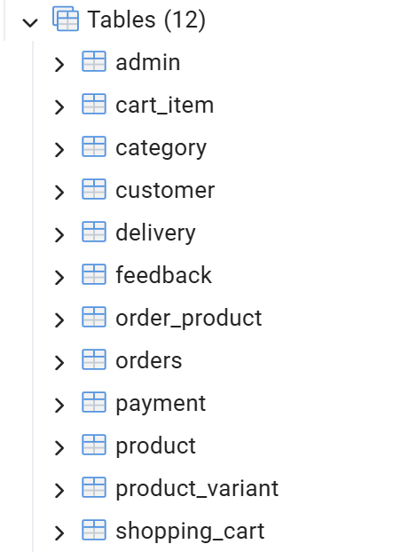
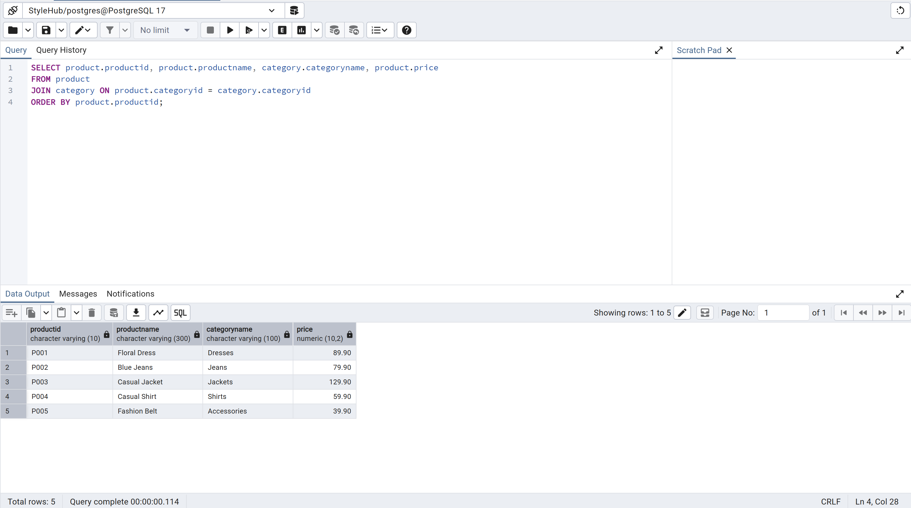
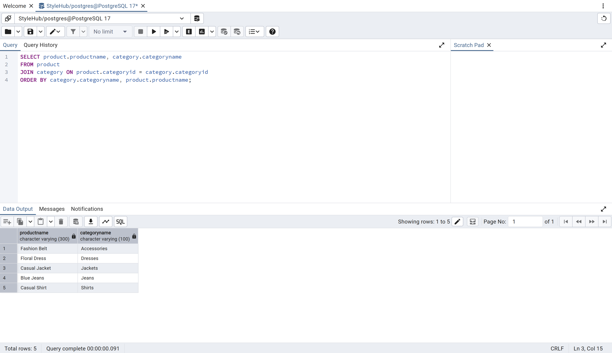
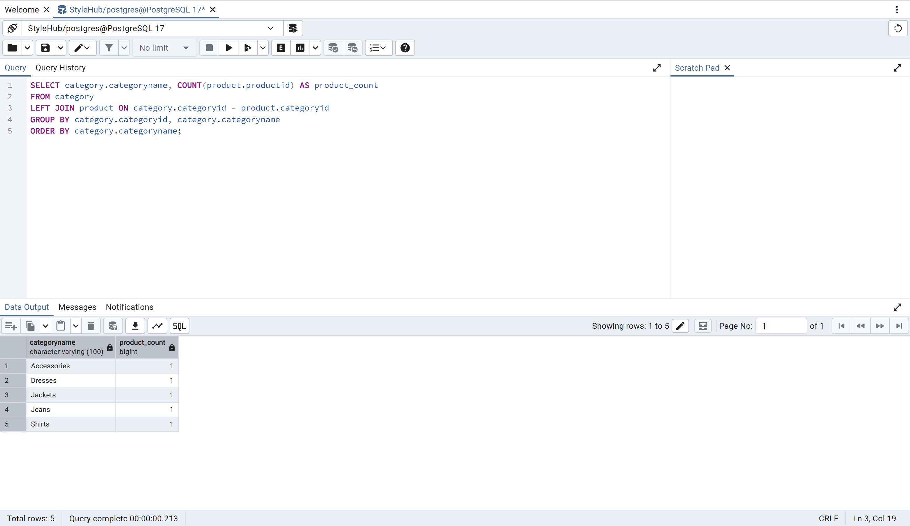
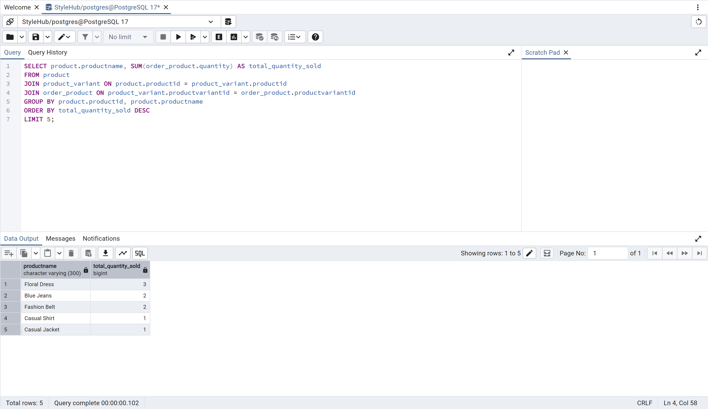

# StyleHub Online Store Database

A PostgreSQL database project designed for an online clothing shopping platform called **StyleHub**.

The database was created to manage customers, clothing products, product variants, shopping carts, orders, deliveries and customer feedback in a centralized system.

This was developed as an academic group project for the Database Systems module in the Diploma in Information and Communication Technology programme.

---

## Project Overview

StyleHub is an online fashion retailer that sells products such as shirts, dresses, jeans, jackets and fashion accessories.

The company previously relied on partially manual processes, which made it difficult to manage:

- Customer information
- Product inventory
- Shopping carts
- Customer orders
- Product variants
- Delivery updates
- Customer reviews
- Sales information

This database project provides a structured solution for storing and managing these operations using PostgreSQL.

---

## Project Objectives

The main objectives of this project were to:

- Design a relational database based on the StyleHub business requirements
- Identify entities, attributes and relationships
- Define business rules for the online shopping system
- Perform normalization from UNF to Third Normal Form
- Create the database tables using SQL DDL statements
- Populate the tables with sample data
- Write SQL queries for data retrieval and analysis
- Apply constraints to maintain data integrity
- Generate reports using joins and aggregate functions

---

## Technologies Used

- PostgreSQL
- pgAdmin 4
- SQL
- draw.io
- GitHub

---

## Database Features

The database supports the following operations:

- Registering and managing customers
- Organising products into categories
- Storing product sizes, colours and stock information
- Managing shopping carts and cart items
- Recording customer orders
- Storing products included in each order
- Managing payment information
- Tracking delivery status
- Recording customer ratings and feedback
- Updating product prices
- Generating sales and product reports

---

## Database Entities

The project includes the following main entities:

- Customer
- Category
- Product
- Product Variant
- Shopping Cart
- Cart Item
- Orders
- Order Product
- Payment
- Delivery
- Feedback
- Admin

---

## Entity Relationship Diagram

The Entity Relationship Diagram shows the tables, attributes, primary keys, foreign keys and relationships used in the database.



Some important relationships include:

- One customer can place many orders
- One category can contain many products
- One product can have many product variants
- One order can contain many product variants
- One customer can have a shopping cart
- One order can have payment information
- One order can have delivery information
- Customers can provide feedback for purchased products

---

## Repository Structure

```text
stylehub-online-store-database/
├── README.md
├── database.sql
├── queries.sql
├── erd.png
└── screenshots/
    ├── database_tables.png
    ├── populated_data.png
    ├── query_results_1.png
    └── query_results_2.png
```

### File Descriptions

- `database.sql`  
  Contains table creation statements, constraints and sample data.

- `queries.sql`  
  Contains SQL queries used to retrieve, analyse, update and modify data.

- `erd.png`  
  Contains the Entity Relationship Diagram.

- `screenshots/`  
  Contains screenshots of database tables and executed SQL query results.

---

## SQL Concepts Demonstrated

This project demonstrates the use of:

- `CREATE TABLE`
- Primary keys
- Foreign keys
- `NOT NULL`
- `UNIQUE`
- `CHECK`
- `DEFAULT`
- `INSERT`
- `SELECT`
- `WHERE`
- `ORDER BY`
- `INNER JOIN`
- `LEFT JOIN`
- `GROUP BY`
- `COUNT`
- `SUM`
- `AVG`
- `UPDATE`
- `ALTER TABLE`
- `LIMIT`

---

## Example Queries

### Display Products with Their Categories

```sql
SELECT
    product.productname,
    category.categoryname
FROM product
JOIN category
    ON product.categoryid = category.categoryid;
```

### Count Products in Each Category

```sql
SELECT
    category.categoryname,
    COUNT(product.productid) AS product_count
FROM category
LEFT JOIN product
    ON category.categoryid = product.categoryid
GROUP BY category.categoryid, category.categoryname;
```

### Display the Top Five Most Purchased Products

```sql
SELECT
    product.productname,
    SUM(order_product.quantity) AS total_quantity_sold
FROM product
JOIN product_variant
    ON product.productid = product_variant.productid
JOIN order_product
    ON product_variant.productvariantid =
       order_product.productvariantid
GROUP BY product.productid, product.productname
ORDER BY total_quantity_sold DESC
LIMIT 5;
```

### Calculate the Average Rating for Each Product

```sql
SELECT
    product.productname,
    ROUND(AVG(feedback.rating), 2) AS average_rating
FROM product
JOIN product_variant
    ON product.productid = product_variant.productid
JOIN feedback
    ON product_variant.productvariantid =
       feedback.productvariantid
GROUP BY product.productid, product.productname
ORDER BY average_rating DESC;
```

More queries are available in:

```text
queries.sql
```

---

## How to Run the Database

### Requirements

Make sure the following software is installed:

- PostgreSQL
- pgAdmin 4

### Method 1: Run the SQL File in pgAdmin 4

1. Open pgAdmin 4.
2. Connect to the PostgreSQL server.
3. Create a new database.

Example database name:

```text
stylehub_database
```

4. Select the new database.
5. Open the Query Tool.
6. Open the `database.sql` file.
7. Execute the SQL script.
8. Open `queries.sql`.
9. Run the queries individually to view their results.

---

### Method 2: Use the PostgreSQL Command Line

Create the database:

```bash
createdb stylehub_database
```

Import the SQL script:

```bash
psql -d stylehub_database -f database.sql
```

Run the query collection:

```bash
psql -d stylehub_database -f queries.sql
```

---

## Screenshots

### Database Tables

The database contains tables for customers, categories, products, product variants, orders, deliveries, feedback and shopping carts.



---

### Populated Product Data

The database contains sample product records connected to their respective categories.



---

### Products and Categories

This query uses an inner join to display every product together with its category.



---

### Product Count by Category

This query uses a left join, grouping and the `COUNT` aggregate function to calculate the number of products in each category.



---

### Top Five Purchased Products

This query joins the product, product variant and order item tables to calculate the total quantity sold for each product.



---

## My Contribution

This was an academic group project.

My individual contribution included:

- Preparing sample data for the Customer table
- Preparing sample data for the Category table
- Preparing sample data for the Product table
- Preparing sample data for the Product Variant table
- Writing and testing selected SQL statements
- Testing database records using pgAdmin 4
- Contributing to discussions about table relationships and the ERD
- Verifying that queries produced the expected results

Other parts of the project were completed collaboratively with the group.

---

## What I Learned

Through this project, I learned how to:

- Convert business requirements into database entities
- Define relationships between tables
- Identify primary and foreign keys
- Apply normalization up to Third Normal Form
- Create tables using appropriate data types
- Apply constraints to maintain data integrity
- Insert and update database records
- Retrieve information using SQL queries
- Join information from multiple tables
- Use aggregate functions for reports
- Test and debug SQL statements in pgAdmin 4
- Back up and restore a PostgreSQL database
- Work collaboratively on a database project

---

## Challenges Faced

Some challenges encountered during development included:

- Identifying the correct relationships between entities
- Deciding where foreign keys should be placed
- Avoiding unnecessary duplication of data
- Matching SQL queries with the final table structure
- Writing joins across several connected tables
- Ensuring sample data satisfied all foreign-key constraints
- Updating the ERD after changes to the database design

These issues were resolved through database testing, group discussion and revision of the schema.

---

## Academic Project Notice

This repository is provided for portfolio and learning purposes.

It represents an academic group project. The project has been cleaned for public presentation, and personal information, student identification details and lecturer materials have been excluded.

---

## Author

**Wong Kai Cheng**

Diploma in Information and Communication Technology  
Asia Pacific University of Technology & Innovation

LinkedIn: [Wong Kai Cheng](https://www.linkedin.com/in/wong-kai-cheng-a3a5613b5)

---

## Licence

This project is intended for educational and portfolio purposes.